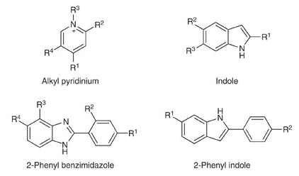
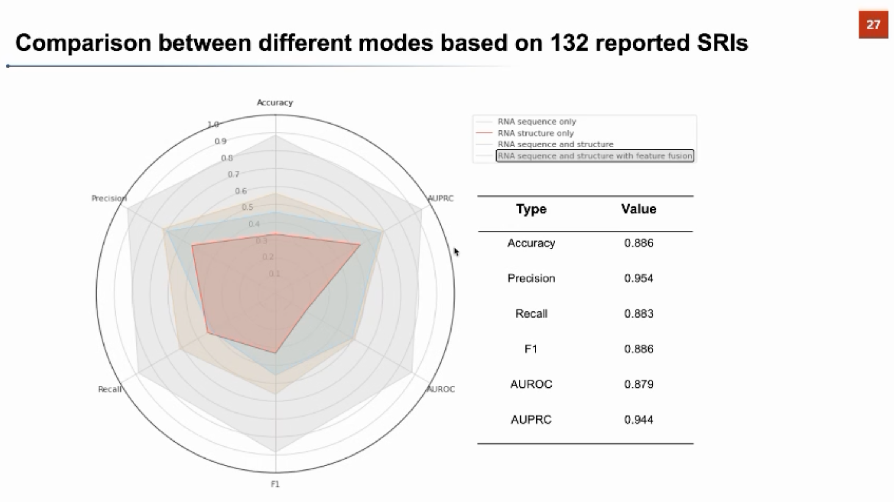
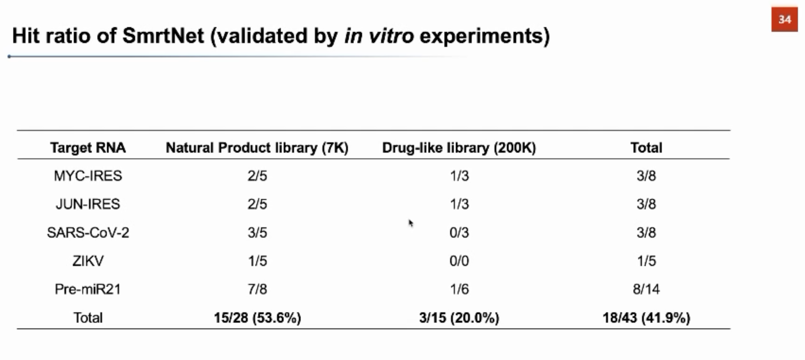

# Small RNA-Targeting Molecule Design  

**Identify, validate and optimize** small molecules that target the functional transcriptome  

---

##  Introduction

TODO: importance, history, diffculties in this field 

predict structure -> determine function -> predict binding selectivity 

###  Methods to model RNA structure :  
It's a key to design an accurate model of RNA strcuture to modulate small molecules. Computational methods can model RNA structurefrom sequence.  

- Free energy minimization: Assume fucntional structure is in minimum free energy structure. Calculating the **free energy of each substructure**,such as pairs,bulgers and loops.Algorithm such as **mFold,RNAFold,RNAStructure** incorporating these thermodynamic paramteres deteremined by experiments.(~70% accuracy)  

- Chemical modification : This will inducing pause of reverse transcriptase and mutation.  

- Biophysical 3D assay : X-ray crystallography, NMR spectrometry and cryo-electron microscopy (cryo-EM)  

- Phylogenetic comparison(conservation) : Genetic differnce preserved in secondary structure Covariation-based  structural prediction is highly acccurate(compared to crystal structures)  

    **R-scape**  

- Homology modelling: Homology modeling is a method for predicting the 3D structure of proteins based on the principle that "if two proteins have high enough sequence similarity, they are likely to have very similar 3D structures". Homology modeling typically uses a protein with a known structure as a template, and builds the 3D structure of the target protein by simulation and optimization based on the amino acid sequence of the target protein.

- 3D structure prediction : Predicting program :  **FARFAR2,MC-Fold/MC-Sym and iFoldRNA, RNAdolf,Sfold,CONTRAfold** Scoring function for structure with unknown native structure(stable 3d structure): Rosetta, RASP, **ARES**(Outperform others, Verified by RMS to known crystal structure)    

###  Assessing quality of predictions  

Without a known structure, it is hard to assess the reliability and accuracy of the prediction, which has been addressed by development of various statistical methods.

- Partition fucntion : It contains all of the thermodynamic infomation of system. This fucntion has been incorporated into various programs.( **RNAfold, Sfold and CONTRAfold**)  

- Statistics : Phylogenetic comparisons have applied statistics to demonstrate the significance in evolutionary covariation, associating with the fucntionality.  

### This part is reserved for functionality prediction  

### Selectivity of small molecules tagerting DNA  

It's intractable to construct small molecules that be selective for target RNA. 
- Lack of structural diversity 
- Anionic backbone(???)  
- Diffculties in high-throughput screen(much lower hit ratio than proteins)
- Huge differences between predicting strcuture/function and binding affinity 

Factors that affect the selectivity :  

- Uniqueness of the structure in the transcriptome  
- Expression of the target compared with off-targets(same affinity, highly expressed target will occupy ligands)    
- Relative affinity of the small molecule for on-and-off-targets 
- Accessibility of the target site 
- Functionality of the binding site  

Notice that : Compounds can be designed that target multiple sites within an RNA target simultaneously, thus overcoming the limitations of structural degeneracy(a structure is not unique in the transcriptome).

## Approaches for indentifing small-molecule RNA binders  

### Target-centric approaches  

Target-centric means that for the small molecules' only choice for binding are single or a few targets.

- Affinity mass spectrometry : **ALIS**(automated ligand
identification system) uses indirect dectection of target-ligand interaction before liquid chromatography. 

    It's similar to AS-MS(Affinity selection mass spectrometry, direct identification of target-ligan complexs by mass spectrometry) widely used in proteins.   

- Fluoscence-based assays :  This is a high-throughput assay relies on displacement of a fluorescent dye or compound by a small molecule of interest.   

- Microarray-based screening : 

- Fragment-based ligand dicovery :  Fragment-based ligand discovery uses libraries of low-molecular-weight compounds to efficiently explore chemical space that might bind the target of
interests.(**2DCS**,Two-Dimensional Combinatorial Screening)

- DNA-encoded compound libraries ：

--- 

# Methods applied in paper : Targeting SARS-CoV-2

## Step.1 Determining binding site of SARS-CoV-2, which is an **attenuator hairpin(AH)**    

From previous experience, small molecule binders have prefrence for RNA hairpin strcuture over other structures including internal loops, bulges and base pairs.  
Also, notice that The common scaffolds include **indole, 2-phenyl indole, 2-phenyl benzimidazole** and **pyridinium groups**.  

> Conclusions are from *Identifying the preferred RNA motifs and chemotypes that interact by probing millions of combinations, Tuan*
## Step.2 Verifying the structure of binding target :  
- Free energy minimization & Phylogenetic conservation   
    Via **ScanFold and RNAz**, we can determine and verify 3D structure of binding site 
    ScanFold: is a genome-wide approach for discovering local RNA structural elements. It uses a scanning analysis window to predict RNA structures and folding metrics to deduce regions likely to form functional structure. The approach considers all base pairs from analysis windows and weights them by favorable folding, resulting in unique base pairing throughout the genome and the generation of local regions/structures that can be ranked by their propensity to form unusually thermodynamically stable folds. ScanFold has been applied to the Zika virus and HIV-1 genomes, successfully identifying and modeling the structures of known functional motifs in both viruses, while also finding additional regions likely to form functional structures1.

    RNAz: is a tool for predicting conserved RNA secondary structures in multiple sequence alignments. It uses a comparative approach to identify conserved RNA secondary structures in a set of related RNA sequences. RNAz calculates a score for each base pair in the alignment, based on the probability of observing the base pair in a random sequence. The score is then used to identify conserved RNA secondary structures in the alignment.  

- Structural mapping data 
    Via **DMS-Mapseq**
    **DMS-MaPseq** is a chemical probing method that uses **dimethyl sulfate (DMS)** to mark unpaired adenine and cytosines with a methyl group at Watson-Crick base pairing positions N1 and N3, respectively . It is used to study RNA structure in vitro or in vivo. DMS-MaPseq has been applied to profile in vivo RNA secondary structure in rice , and has been used to study the RNA structure of SARS-CoV-2 . 

## Step.3 Identify candidates of small molecule binders : 
- Physiochemical properties of known ligands binding target  
    (**Inforna database**, the RNA-binding ligand data set)
    Hafeeze team choose 3,271-member RNA-focused compound collection(descriptions of these choices is **vague**)
    
## Step.4 Screening the binders :    
- Microarray-based screening, **AbsorbArray**    
    They identified 26 binders from 3271-collection   
- Trianged 26 hits into three classfication       

    phenyl benzimidazoles (n= 11)  
    phenyl thioureas (n = 6)
    2,4-diaminoquinazolines(n = 7)  
- Dose reponse/Competitive screening 
    Remain only 5

## Conjecture:  
The research may adopt Fragment-based or similar methods to screen binders. But questions still remained(AbsorbArray operation)  

>About **Inforna database**: An approach that can mine motifs (secondary structures) within target RNAs, which is deduced from the RNA sequence, and compare them to a database of **known** RNA motif-small molecule binding partners.
Herein, we describe Inforna 2.0, which incorporates all known RNA motif-small molecule binding partners reported in the scientific literature, a chemical similarity searching feature, and an improved user interface and is freely available via an online web server.   

Inforna 2.0 contains **1936 RNA motif-small molecule interactions**(224 unique small molecules and 1331 motifs)

I would like to introduce a researcher *Matthew D. Disney*, who developed Inforna database and greatly promoted the field of RNA-SmallMol binders.  

TODO: here, adding more information about Inforna 

**Matthew D.Disney:**   
> *2020,Programming inactive RNA-binding small molecules into bioactive degraders*

>*2023,Targeting the SARS-CoV‑2 RNA Genome with Small Molecule Binders and Ribonuclease Targeting Chimera (RIBOTAC) Degraders*

>*2012,Identifying the preferred RNA motifs and chemotypes that interact by probing millions of combinations*

>*2016,Inforna 2.0: A Platform for the Sequence-Based Design of Small Molecules Targeting Structured RNAs*  

>*2008,Two-Dimensional Combinatorial Screening Identifies Specific Aminoglycoside-RNA Internal Loop Partners*

TODO: above adding more desciption/highlight on each paper  

---

# Research of Qiangfeng Zhang   
## PrismNet  
TODO: do more reading on this paper  

## SmrtNet  
### Versus  
- Previous methods for predicting RNA binders:  
    - Predicting targets on a given RNA that bind to small molecules   
    - Predicting which class of small molecules can bind to nucleic acids (RNA vs. DNA)   
    - Predicting the molecular fingerprint of a small molecule that binds to a given RNA tertiary structure  

TODO: above make decription on them, and I'm not clear with 1 & 3  

- Innovation of **SmrNet** :  
    - High-throughput prediction of small molecule interactions with RNA targets using deep neural networks and interpretable analysis of small molecule-RNA binding interfaces.

TODO: Read more on this paper. Find current Nets for this task. 

### Implementation:  
- Dataset:  Data are from **Protein Data Bank**.RNA-motifs:1300 SmallMols: Unknown  
- Modelling the feature(fingerprint): 
    - For RNA-motif: ncRNA-LM
    - For SmallMol: Molformer  
    - Novel methods for feature fusing 
- Net structure: Unknown  
- Results: 
132 RNA-small molecule interaction pairs **reported in the literature** and experimentally validated were collected to form a test dataset that has not appeared at all in model training, SmerNet achieved excellent performance:

Wet experimental validation results of SmrtNet against **five** RNA targets  
   