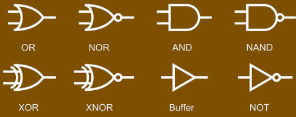
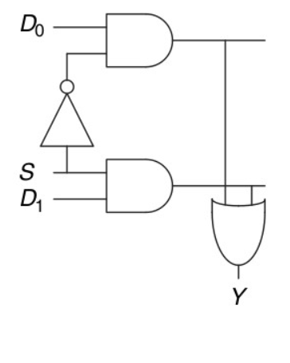
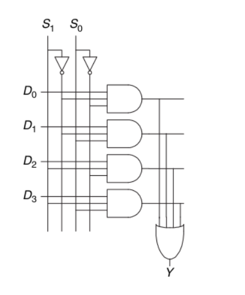
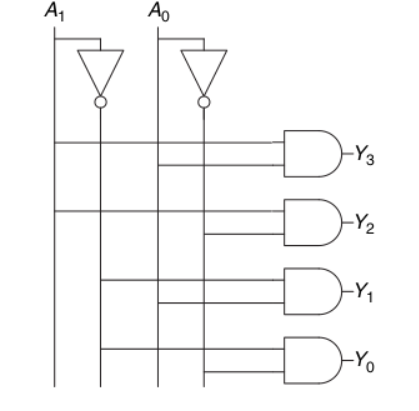
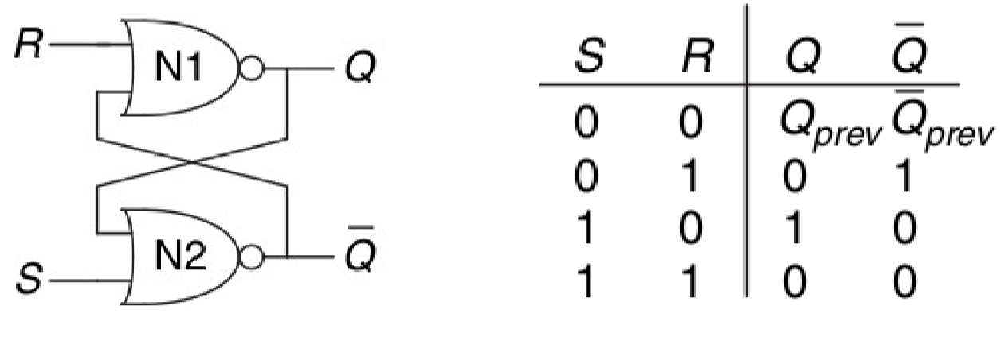
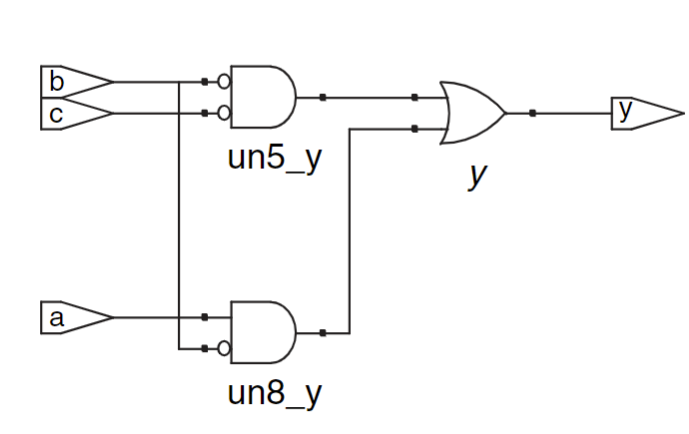

#! https://zhuanlan.zhihu.com/p/689477326
# Digital System
This is course notes.
Related materials are in
## L1: Number representation

## L2: Logic Gates

### Boolean Circuit  
Def: n inputs, m outputs, acyclic graph   
In the graph: vertex represents a basis function or input  

Basis function is abstract of boolean algorithm  
Functional Completeness: *basis of logical fucntions* is complete $\iff$ all possible possible truth tables canb be represented by combination of logics fucntions in the set(basis)

## logic gates


## L3: Combinational circuits $& Boolean Logic  

### Combinational Circuit 
Def:  
- Every circuit element is itself combinational.
- Every node of the circuit is either designated as an input to the circuit or connects to exactly one output terminal of a circuit element
- The circuit contains no cyclic paths: every path through the circuit visits each circuit node at most once.  

### Boolean logic 
Terminology:   
**literal**: variable and its complement $A \bar A$   
**product**(implicant): AND of laterals  
**minterm**: a product involving all of the inputs to the function  
**maxterm**： a sum involving all of the inputs to the function  

Order of operations:  
$NOT \gt AND \gt OR$

Formulate equation for any truth table:  
Each row of truth table can associate with a minterm of inputs which is True(a maxterm which is False)
Sum of products canonical form:
$$F(A,B) = \sum_{F(A,B)=TRUE}{maxterm(A,B)}$$ 
Product of sums canonical form:
$$F(A,B) = \prod_{F(A,B)=FALSE}{minterm(A,B)}$$

This kind of form is called two-lwvwl circuit
### Boolean Algebra
The axioms and theorems obey duality: interchange the 0/1 and or/and , the statement still is correct.  
AXIOMs: 
- Identity
- Null Element 
- Idempotence
- Involution
- Complements

THEOREMS:
- Commutativity
- Associativity
- Distributivity
- Covering
- Combining
- Consensus
- De Morgan's Theorem

Def:
- minmized sum-of-products: if it uses the fewest possible impli-
cants
- prime implicant:  it cannot be combined with any other implicants in the equation to form a new implicant with fewer literals

### Karnaugh maps
### Building block
- Tristate buffer
- Multiplexer(can be achieved by tristates buffer)
- 
- 
- Decoder
- 
### Dealy
- Propagation delay (tpd) is the maximum time from when an input changes until the output or outputs reach their final value.
- Contamination delay (tcd) is the minimum time from when an input changes until any output starts to change its value


## L: Sequential Logic Design
(Def?)Sequential logic: Unlike combinational logic circuit which is only func of the present input, sequential logic circuit output denpends on the present and past inputs 
bitstable: the cyclic circuit has no conflicts, then we can say it's bistable

Some bitstable elements:  
- SR Latch
(S:set R:reset)


- flip-flops
! TODO

## Machine Language
HDL: Hardware description language  
SystemVerilog and VHDL  
Purpose of HDL: logic simulation and synthesis(textual info to hardware link)  
```
module sillyfunction(input logic a, b, c,
output logic y);
    assign y = ~a & ~b & ~c |
    a & ~b & ~c |
    a & ~b & c;
endmodule
```

bitwise operator(on multi-bit busses)
```
module inv(input logic [3:0] a,
output logic [3:0] y);
    assign y = ~a;
endmodule
```
time delay:
```
‘timescale 1ns/1ps
module example(input logic a, b, c,
output logic y);
logic ab, bb, cb, n1, n2, n3;
    assign #1 {ab, bb, cb} = ~{a, b, c};
    assign #2 n1 = ab & bb & cb;
    assign #2 n2 = a & bb & cb;
    assign #2 n3 = a & bb & c;
    assign #4 y = n1 | n2 | n3;
endmodule
```
- tri: signal in net(multi-driver in a bus)  
- z: floating value 
- x: invalid logic value
- N'BaseValue: 10'hAA 10bits hex AA
- bit swizzling: {} is to concatnate bits  
- sequential: use `always` statements(assgin is continous, revalueted anytime)  

 