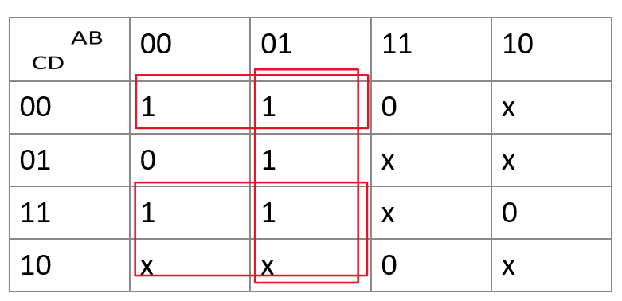
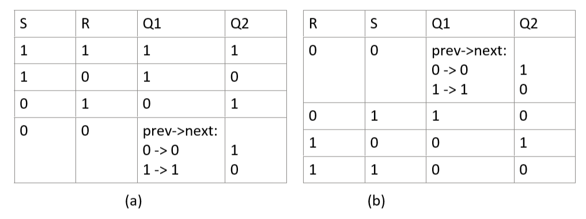
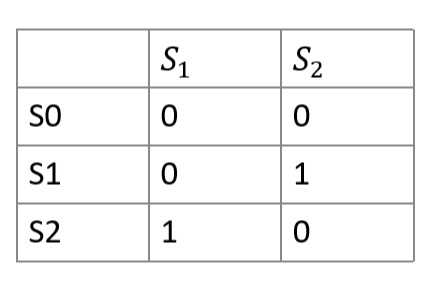
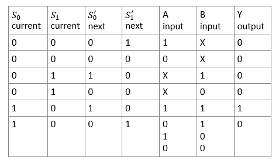
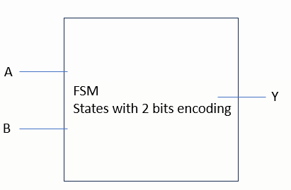
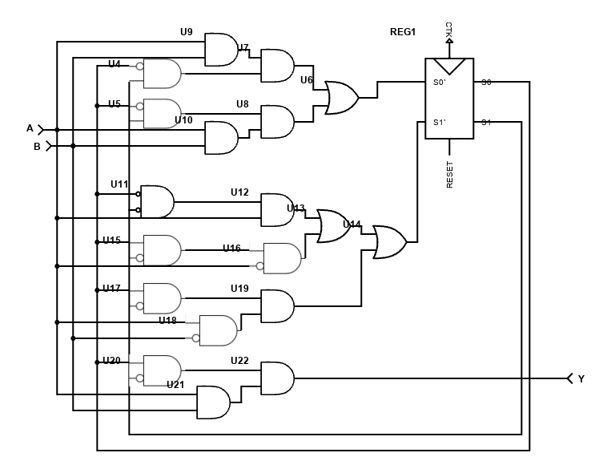
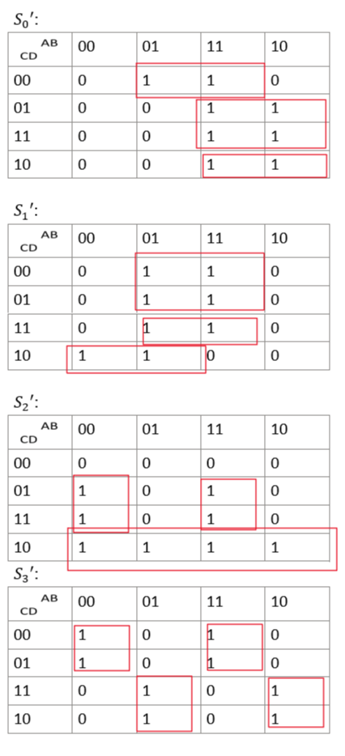
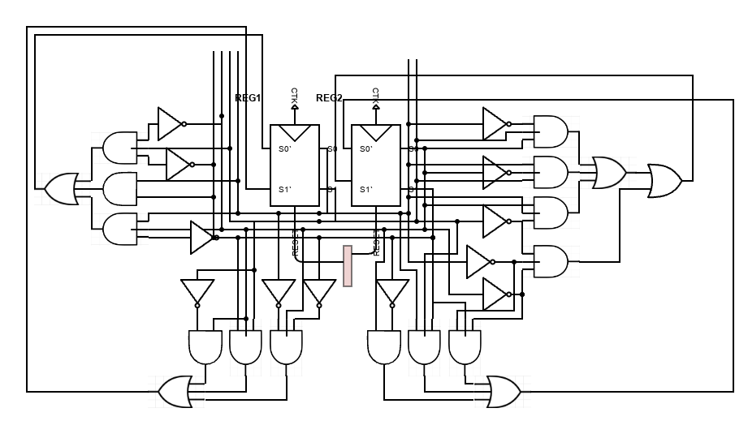

# Digital system design HW2
## 1.

$$Y= \bar A \bar B \bar C+\bar A B + \bar A C$$ 
## 2. 
$dec = \sum{Y_i \cdot {j_i}^i}$ 
$(dec+1$) is the index of the most significant bit, hence 
$$
A_i = 0, if \ i > dec+1\\
A_i = 1, if \ i = dec+1\\
A_i = X, if \ i < dec+1
$$

## 3.
Use perfect induction to check whether they are equivalent.
When $\bar S =1, \bar R=1(S=0,R=0)$ in circuit (a), we cannot derive the out if previous signals were given, hence we consider different situation for Q1 and Q2. 

The truth value table is same except for $S=1,R=1$, so they are not fully equivalent.

## 4.
**case CLK=0:**
- the input of the right quasi-SR-latch is all zero, in this situation it's always locked  

**case CLK on the rising edge:**
- case Data=1: the upper input of right quasi-SR-latch is stable only in statue `0 1`, hence Q is `1`
- case Data=0: the the  input of right quasi-SR-latch is stable only in statue `1 0`, hence Q is `0`
- conclusion: bits in `Data` is passed to `Q`

**case CLK=1:**
- case Data 1->0: the top left quasi-SR-latch is locked, hence the the upper input of right quasi-SR-latch still maintain the previous value  
- case Data 0->1:  both left quasi-SR-latch are locked

Summary: Q is always locked in the previous status until a rising edge of clock 

## 5. 
States encode:

Transition table:

Boolean equation:
${S_0}^\prime = \bar{S_0} S_1 X B + S_0\bar{S_1}AB $
${S_1}^\prime = \bar{S_0} \bar{S_1}AX +S_0\bar{S_1}(\bar A B +A\bar B +\bar A \bar B) = \bar{S_0} \bar{S_1} AX +S_0 \bar{S_1}\bar{A} +S_0\bar{S_1}A\bar B$
$Y=S_0 \bar{S_1}AB$ 

Schematic circuit:

## 6. 
K-map of bits of status:

(4 bits of gray code are:`A B C D`)
Boolean equation:
${S_0}^\prime=B\bar C\bar D +AD+AC\bar D$
${S_1}^\prime=B\bar C+BCD +\bar AC\bar D$
${S_2}^\prime=\bar A \bar B D +ABD+C\bar D$
${S_3}^\prime=\bar A \bar B \bar C+\bar ABC +AB\bar C+A\bar B C$
Use 2 2in-2out registers to construct the circuit：

## 7. 
Apply the same method and add gates to decide which state transition will be applied for that bit.