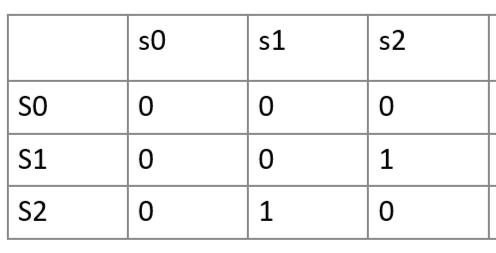

# HW3
Mingxi Chen 999019482  
## Nr.1 

**State encoding:**
FSM for X:
$s_{i}$: state in which A has been 1 for $i$ cycles, if the next states make $X=1$ (4 `1` in total occurs, reset to s0)  
(Y =0 if not be shown on the arc )

FSM for Y:
$s_{i}$: state in which A has been 1 consectively for $i$ cycles. (3 `1` consectively occurs, reset to s0)

**State transition diagram:**
X, Y=0 if it's omitted on the arc.


**State transiion table:**
FSM for X:

$S^\prime_0 = \bar S_0 S_1 A + S_0 \bar S_1  + S_0 S_1 \bar A$ 
$S^\prime_1 = \overline{S_0 S_1} A + \bar S_0 S_1 \bar A + S_0 \bar S_1 A + S_0 S_1 \bar  A$
$X = S_0 S_1 A$
FSM for Y:

$S^\prime_0= \bar S_0 S_1 A$
$S^\prime_1= \overline{S_0 S_1} A$
$Y = S_0 \bar S_1 \bar A$
**schematic**


## Nr.2 
*States encoding:*
$s_0$: pattern `0` occurs
$s_1$: pattern `01` occurs
$s_2$: pattern `010` occurs
$s_3$: pattern `0100` or `0111`occurs
$s_4$: pattern `011` occurs
$s_5$: pattern `1` occurs
A: input
X: output 
We consider the FST for pattern recognition task is cylic(for asylic situation just ending in the $s_3$).  


**States transition diagram:**
> Initial state can be $s_0$ or $s_5$
> Only output 1 when $s_3$ is reached, then reset.(for acyclic siutation, end here)


**States transition table:**

**Next state:**
$S_0 = \overline{S_0 S_1 S_2} A + \bar S_0 S_1 \bar S_2+ S_0 S_1 \bar S2 A + \bar S1 S2 A \\
S_1 = S_0 \overline{S_1 S_2 A} + \bar S_0 S_1 \bar S_2 \bar A \\
S_2  = S_0 \overline{S_1 S_2} A + S_0 S_1 \bar S_2 A + S_0 \bar S_1 S_2 A$

**Output:**
$X = \bar S_0 \bar S_1 \bar S_2 A +\bar  S_0 \bar S_1 S_2 A$

## Nr.3 
This is usually considered as a mealy machine, in which the output depend both on inputs and current states. But taking input as part of states makes it a moore machine.


**States encoding:**
$s_0: A_{n-1} = 0$  
$s_1: A_{n-1} = 1$
$s_0: S=0, s_1: S=1$
**States transition diagram:**
> Notice that $A_{n-1}$ is equvalent to S

> Ouput $Z= S\bar B + S A B$ , which is not shown in graph because it's just $combinatoric\_func(S,A,B)$


**States transition table:**

**Next states and output:**


$S^\prime = A_n$
$Z_n  = A_{n-1}\bar B_n + A_{n-1} A_n B_n $

**Schematic:**


## Nr.4
**Prove that any Moore machine can be transformed into an equivalent Mealy machine:**
For Moore machine, $\exists f: s_i \to Y $, we can easily associate a boolean function and input x such that $bool(s_i, x)  =f(s_i) $, the new relation of output with x and $s_i$ implies it's a mealy machine now. 

**Prove that any Mealy machine can be transformed into an equivalent Moore machine:**
We again use a construction to prove any mealy machine can be transformed.
$\forall s_i,x_i, f(x_i,s_i)$  where $x_i$ is input ,f()is output, we define new states:  
$s^\prime_i= s_i x_i \ ,s^{\prime \prime}_i=s_i \bar x_i$.   
Let $f^\prime(s^\prime_i) = f(s_i, x_i), f^{\prime \prime}(s^\prime_i) = f(s_i, \bar x_i)$

Now we get a moore machine with the same evaluation of the mealy machine.


# Program explaination:

> see the `main.py` which implement the functionality specified in the assignment.

Notice:
The count of minterms in $s_i$ is count of 1 in it.  Because the min-terms are those $bool_{s_k}$ such that $S_0(i,j)=1$ 

Usage:
```py
# change the fsm matrix in main.py
fsm = [ [1,1,1],
        [0,0,0],
        [2,2,2]]

python main.py
```

Test:
```
python main.py

The input matrix is:
[2, 3, 1, 0]
[1, 3, 2, 1]
[2, 3, 3, 1]
[3, 3, 3, 3]


The s0 matrix is:
[0, 1, 1, 0]
[1, 1, 0, 1]
[0, 1, 1, 1]
[1, 1, 1, 1]
The count of min-terms in s0 is 12

The s1 matrix is:
[1, 1, 0, 0]
[0, 1, 1, 0]
[1, 1, 1, 0]
[1, 1, 1, 1]
The count of min-terms in s1 is 11
```
