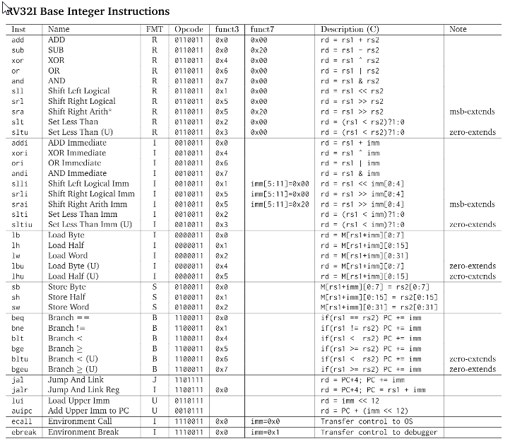

# Practices of Digital system 
Related materials can be found in a directory contained the upper level directory.
- lab instruction: ARM edition(older) RISC-V(newer)  
- odd-exercise solutions 

(RMK: Labs is not following any books or my course, it's selected by myself)

## Lab.1 Assembly code practice
- RISC-V lab10
- use venus online simulator
- RISC-V commonly used instruction 
- Notice that RISC-V use little-endian memory

> Register convention:
> sp: stack poniter
> ra: return addr 
> caller-saved register：could be modified before/after calling. `a0-a7` `t0-t6` `ra`
> callee-saved register: will not be changed before/after calling. `s0-s11` `sp`

```s
# function call demo
Exercise:
add_numbers:
    addi sp, sp, -8  # 分配栈空间
    sw ra, 4(sp)     # 保存返回地址
    sw a0, 0(sp)     # 保存第一个参数

    add a0, a0, a1   # 执行加法操作

    lw ra, 4(sp)     # 恢复返回地址
    addi sp, sp, 8   # 释放栈空间
    jr ra            # 返回到调用者
```
```s
main:
	addi sp, zero, 0 # initialize the stack pointer
	addi s0, zero, 18 # initialize the number to be processed 
    jal loop
    
# end here, don't continue
loop: 
	addi sp, sp, -4 
    sw ra, 4(sp)
    addi s0, s0, -9 # s0=s0-9
    lw ra, 4(sp) 
    blt s0, zero, end-neg # not-divisible break the loop
    beq s0, zero, end # divisible, break the loop
    lw ra, 4(sp) 
    addi sp, sp, 4
    addi ra, ra, -4
    jr ra # return to loop again

end:
	addi s1, zero, 0b00001111
    jr ra
end-neg:
	addi s1,zero, 0b00001000
    jr ra
    
```