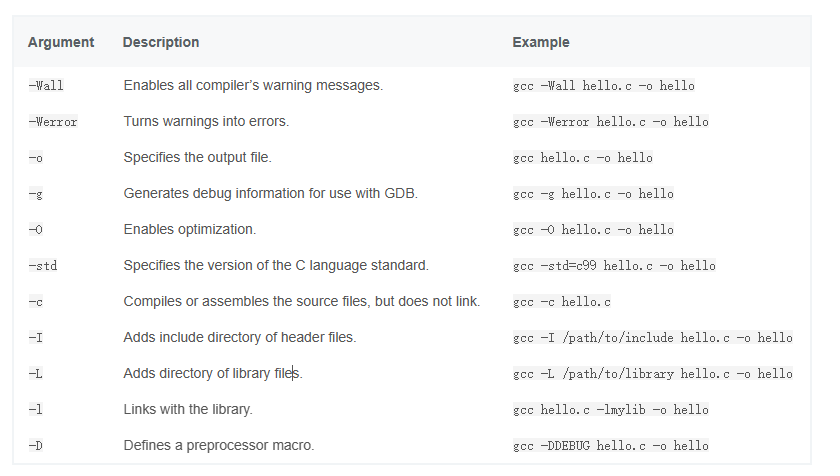
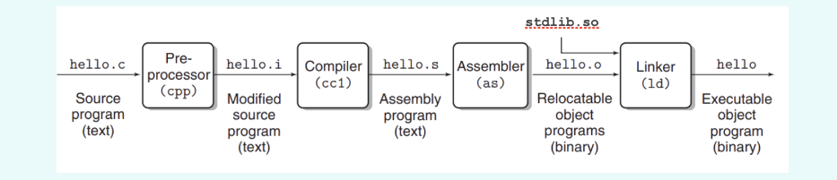
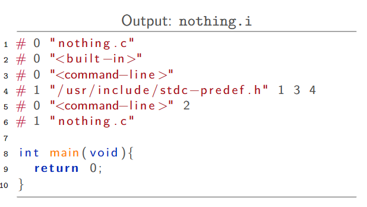

# Introduction to Computer Science
## Common-use command for c


Pipeline:
```
gcc -E test.c -o pre.c   //preprocess
gcc -S pre.c -o asm.s    //to assembly program
gcc -c asm.s -o obj.o    //binary object program
gcc obj.o -o exe
```
Pre-process:
- Linemarkers (lines 1-6) :keep information about file names and lines, which is used by the compiler when reporting errors during compilation

- pre-process directives`#`: 
```
#include <filename> : search in sys-dependent locations
#include "filename" : searrch in the curretn directory
```
- macros`define`: substitute the identifier by the assigned string
- 