# HW: Laminar flow(in a pipe)
Mingxi Chen(999019482) , GTIIT MCS 2023   
## Content: 
1. Problem  
2. Computational domain
3. Mesh and its parameters
4. Model setup and boundary conditions from Fluent

## Problem
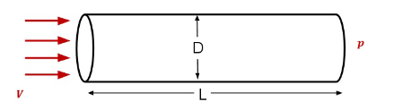

## Computational domain  
Geometric dimensions: 1.6m * 0.2m (2d symmetry)  
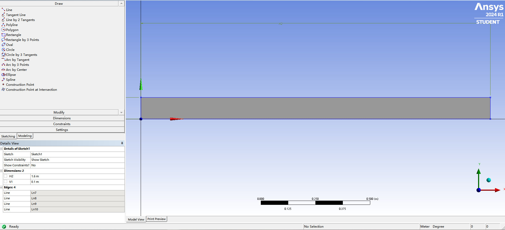

## Mesh and its parameters  
Element size: 8e-3 m
Mesh total: 2814
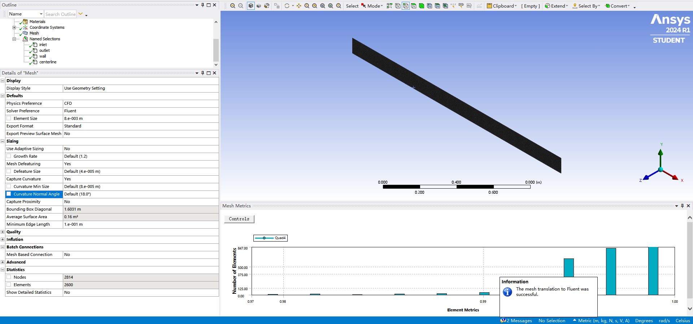

## Model setup and boundary conditions from Fluent
- double precision  
- fluid: acetone , $\rho = 791\ kg/m^3, \nu= 0.000331 \ kg/m\cdot s $, 
$$ Re= {\rho vd \over \mu }$$  
- Velocity of fluid from inlet: 0.7 m/s. We can get $Re$ of acetone in the pipe with diameter of $ 0.2m$, 
- $$ Re = 451.62 $$ 
- model: laminar flow. The flow of liquid is relatively simple in this task, so we only use the laminar model
- Residuals: all set to 1e-6
- Num of iterations: 1000

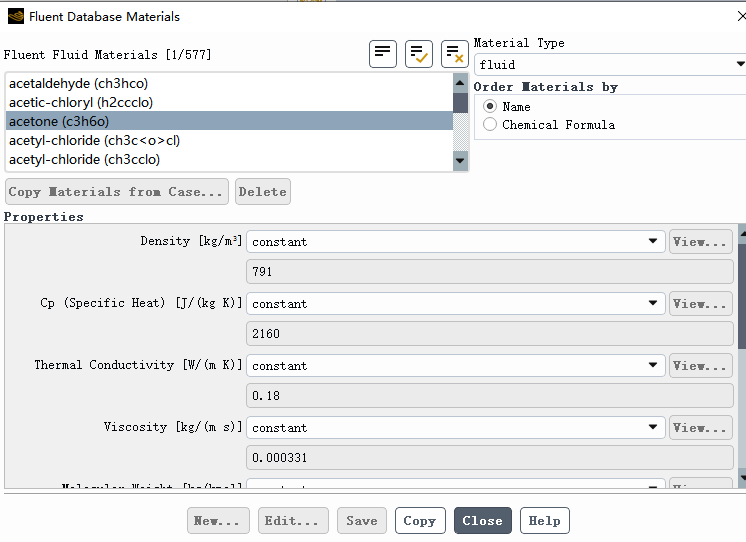
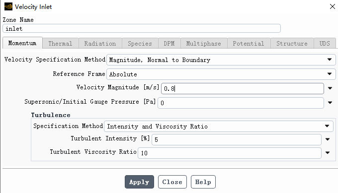
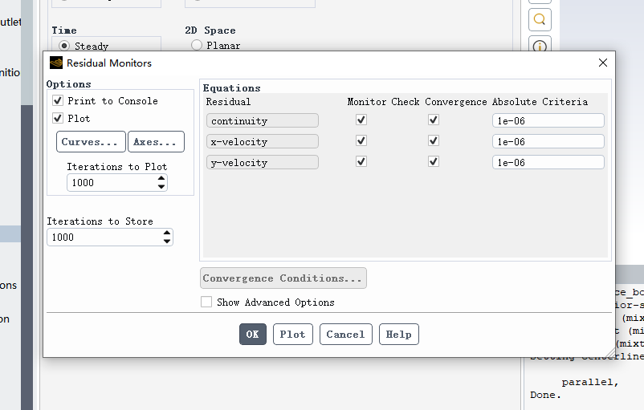
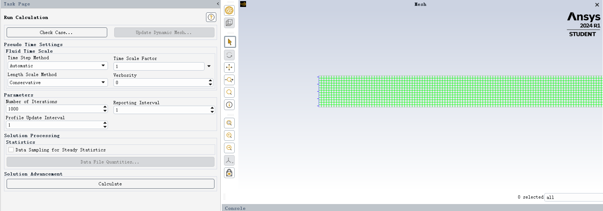  
distribution of velocity and pressure
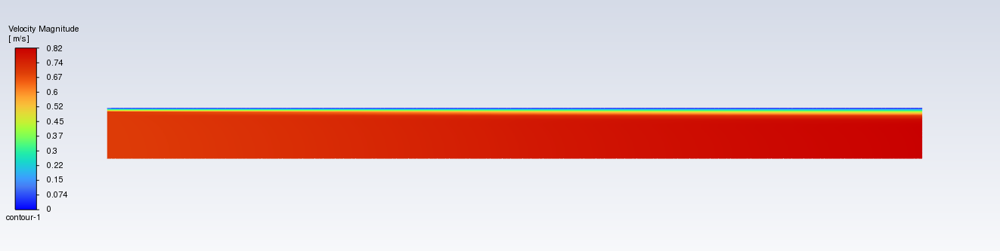
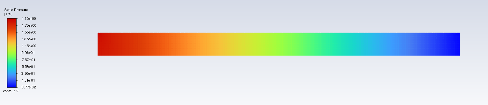
 
# Questions:  
The transition area of laminar flow in the image is not as smooth as in the tutorial. I tried to use different material and reduce the residuals, still it didn't get smooother. Here I present the velocity and pressure along y-aixs(in the middle of the pipe), the distribution is not smooth either.
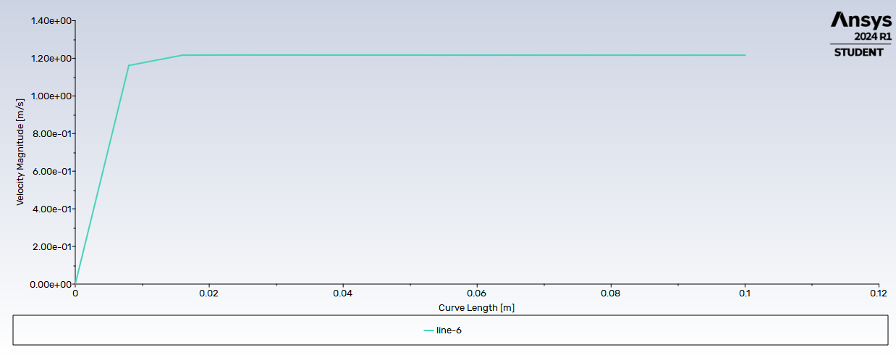
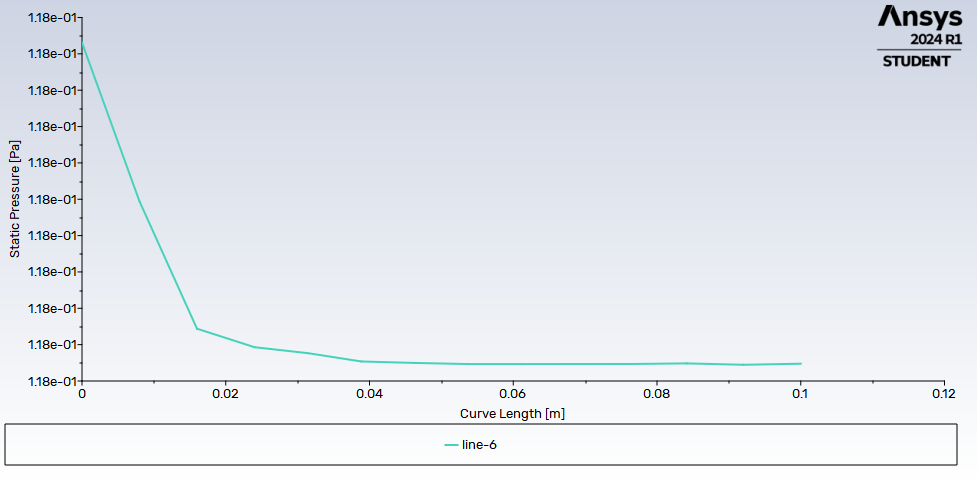