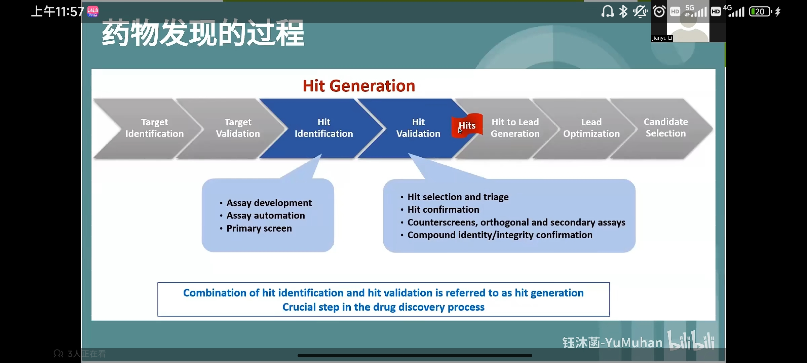
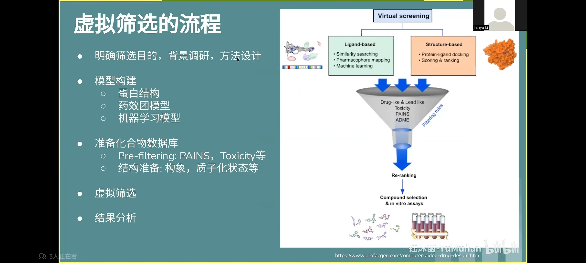

# Introduction to virtual screening 
Reference: bilibili video BV12b4y137Zs 
##  1. 什么是虚拟筛选  
- 正向虚拟筛选：在海量化合物中寻找出针对target of interest有生物活性的苗头化合物
- 反向虚拟筛选：为已有的生物活性分子寻找潜在的target of interest 
tips: 不能直接找到先导化合物，而是先识别出大量的同类活性化合物（以支持后续优化）
- Hits->Lead
从大量的Hits中优化出Lead

##  2. 虚拟筛选的方法  
-  基于配体的筛选  
有已经过验证的活性化合物，让后在分子库中，基于分子指纹、药效团、形状（和已有的进行比对）来筛选出潜在可以bind目标蛋白口袋的化合物 （如ROCS，可以实现基于形状的筛选）
-  基于受体的筛选  
可以基于药效团/分子对接  
（如Schrodinger，可实现基于Docking）

## 3. 化合物数据库选择  

## 4. 筛选的流程  
