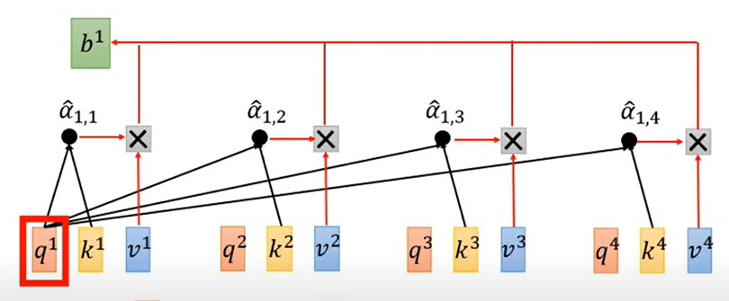

# Transformer architecture  
Transformer的主要思想是用attention layer代替先前的cnn/rcnn的方法，既能并行运算，也能具有全局视野，实现seq2seq的预测任务。  
## 大致结构  
Embedding -> Encoder -> decoder -> Embedding  

## Self attention layer  
 

seq中每一个vec计算对应的query, key, value  
通过矩阵可以计算seq对应的q，k, v
$$[q^{1}|q^{2}|q^{3}|...] = W^{q}[a^{1}|a^2|a^3|...]$$  
$$[k^{1}|k^{2}|k^{3}|...] = W^{k}[a^{1}|a^2|a^3|...]$$  
$$[v^{1}|v^{2}|v^{3}|...] = W^{v}[a^{1}|a^2|a^3|...]$$

$q^i$ 就像一个conv kernel，其输入为sec中的每一个vec_key，（q点乘v）然后输出一组${\alpha}_{i,j}$, $i,j$分别为$q^i,k^j$对应的索引

$$ 
\begin{bmatrix}
    {\alpha}_{1,1}, {\alpha}_{2,1},\dots \\
    {\alpha}_{1,2}, {\alpha}_{2,2},\dots\\
    {\alpha}_{1,3}, {\alpha}_{2,3},\dots \\
    \dots ,\dots, \dots
\end{bmatrix}
=
\begin{bmatrix}
    k^1 \\
    k^2 \\
    k^3 \\ 
    \dots \\ 
\end{bmatrix}
[q^1 | q^2 | q^3 | \dots]
$$ 

将$\alpha$的矩阵经过softmax后称作矩阵A 

$$
[b^1|b^2|b^3|...] = 
[v^1|v^2|v^3|...] 
\begin{bmatrix}
    {\alpha}_{1,1}, {\alpha}_{2,1},\dots \\
    {\alpha}_{1,2}, {\alpha}_{2,2},\dots\\
    {\alpha}_{1,3}, {\alpha}_{2,3},\dots \\
    \dots ,\dots, \dots
\end{bmatrix}
$$ 

将每一个i节点的${\alpha}_{i,:}$作为$v^i$的权重求和得到seq的第一个vec元素输出。在此${\alpha}_{i,:}$可以视作门控（神经元激活）来决定每一个value保留的程度 

Self-attention:  
$$
\text{Attention}(Q, K, V) = \text{softmax}\left(\frac{QK^T}{\sqrt{d_k}}\right)V
$$  

## Multi-head self attention layer  
使用不同的query矩阵$W^q$

TODO: 加入数学公式  

## Positional encoding   
上面的计算方法是不关心seq中元素的位置和顺序的，也就是说任意方式重排seq的元素能得到相同的运算结果，为了加入位置位置信息，我们要在encode时加上position info  
$$e^i + a^i \rightarrow a^i $$
seq中每一个$a^i$有唯一的position $e^i$, 其中的可以通过concat一个postion onehot来实现

## 数学分析  
可以观看视频[深度学习中的数学,transformer]( https://b23.tv/utdihuL)

Lipschitz constant: 在深度学习中，Lipschitz常数通常用来衡量一个网络层或整个网络的稳定性。例如，网络函数的Lipschitz常数对于理解和控制梯度消失或梯度爆炸问题是很重要的。如果Lipschitz常数很大，那么即使输入变化很小，网络的输出也可能会有很大的变化，这可能导致训练过程中梯度的不稳定。相反，如果Lipschitz常数很小，那么网络对输入的微小变化就不那么敏感，这有助于网络的稳定训练。
