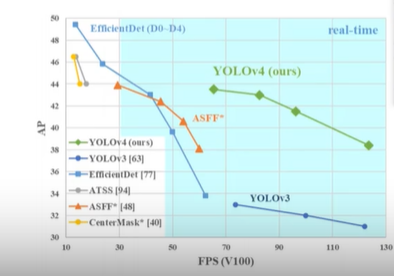
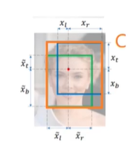
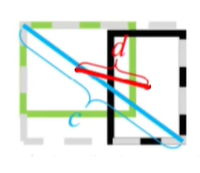
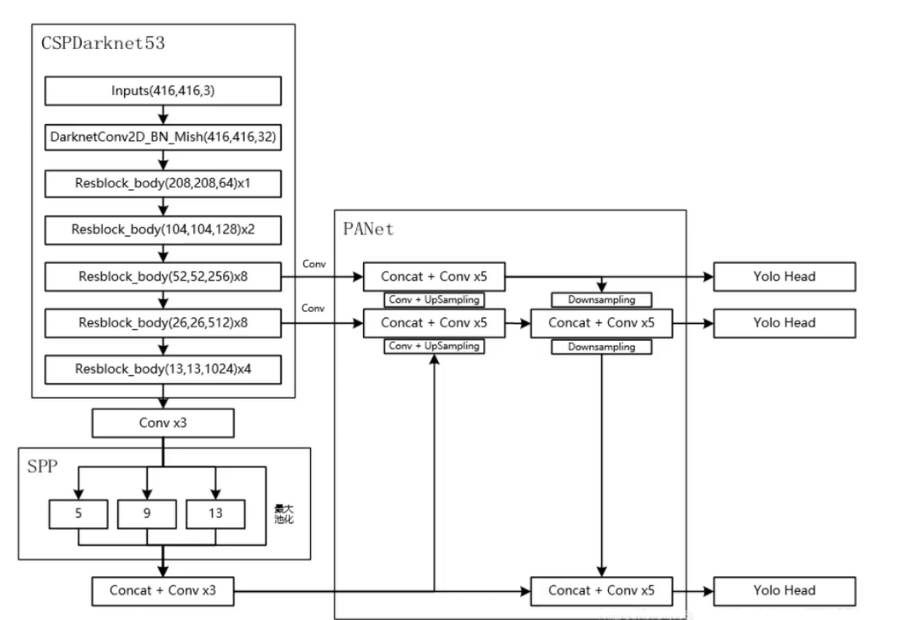
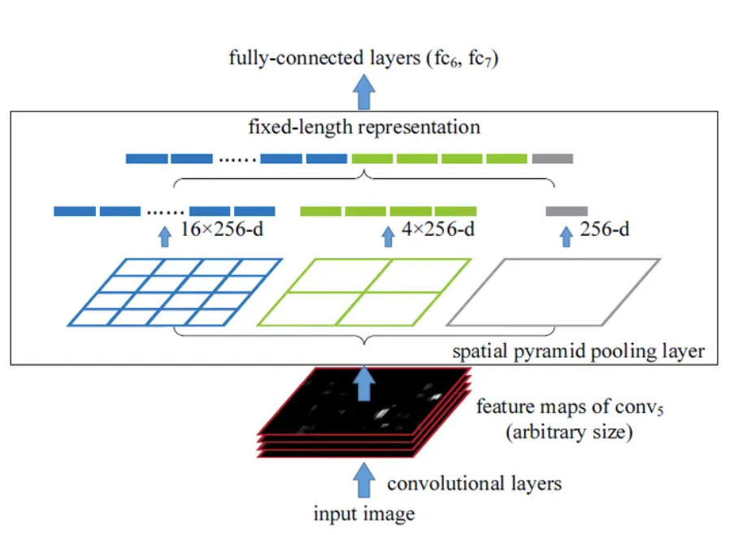
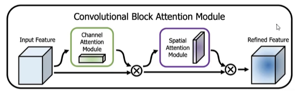

# yolo实战学习
[b站视频链接](https://www.bilibili.com/video/BV1Sc411c7Vo?p=3&vd_source=688fdd17984353145501d2448f6183c1)
## 数据标注软件 labelimg  
可以标注三种数据集： voc(xml) yolo(txt) createML(json)  

    安装    
    pip install labelimg
 
用VOC标注好之后，可以使用官方脚本将VOC转换为yolo格式，并划分验证机

## yolo的数据准备  
- 完成文件结构的整理并修改data.yaml    
- 选择网络结构对应的cfg 
```
--data path/data.yaml
--cfg path/net.yaml
--batch-size 8
```

## 训练及推理  

## yolo的介绍  
yolov4之后的工作都非原作者的研究。yolo的每一个版本都力求在精度和准确率上做到很高的水准  
V4贡献：  
- 算力要求低，单GPU就能很好地完成训练  
- 两大核心方法，通过数据层面和网络设计层面进行改善  
- 吸取融合了很多优秀模型  
- 消融实验(???)


## 数据增强策略  
Bag of freebies(BOF): 
通过一些处理手段，虽然增加了训练成本（推理不受影响），但提高了模型精度    
- 数据增强：亮度、对比度、色调、随机缩放、剪切、反转  
- 网络正则化：Dropout、Dropblock    
- 类别不平衡，损失函数设计   
- Mosaic data augmentation  
- 随机遮挡
- 加随机噪音Self-adversarial-traning(SAT)  
- Dropblock(类似于遮挡，大块大块地drop)  
- Label Smoothing(用于抗过拟合，onehot中加入一些随机波动，不要绝对的01. [0,0,1] -> [0.1,0.1,0.8])   
- IoU在AB没有重叠时为0出现梯度消失，引入GIoU，DIoU,CIoU，其中C是能包括A、B最小封闭形状,d是欧氏距离，c是最小包含的对角线长度，$\alpha$是比例因子，v衡量图片的长宽比。 CIoU很好地考虑了三个几何性质：重叠面积，中心点距离，长宽比
$$L_{GIoU}=1-IoU+\frac{|C-B\cup B^{gt}|}{|C|}$$  



$$L_{DIoU}=1-IoU+\frac{c^2(b,b^{gt})}{c^2}$$  



$$L_{CIoU}=1-IoU+\frac{|C-B\cup B^{gt}|}{|C|} + \alpha v$$  
$$v=\frac{4}{(\pi)^2}(arctan\frac{w^{gt}}{h^{gt}}-arctan\frac{w}{h})^2$$
$$\alpha = \frac{v}{(1-IoU)+v}$$
- Soft-NMS (略)  

## 网络增强策略  
Bag of specials(BOS):  
- 略微增加了推理的代价，提高模型精度  
- 改进网络细节，更好地提取特征  
- 注意力机制、特征金字塔等等各种网络优化结构 



### SPPNet(Spatial Pyramid Pooling)  
- 解决inuput size不同，训练时需要resize的问题，使用最大池化满足最终输入特征一致(将不同尺寸下的特征图融合在一起)  

  


### CSPNet(Cross Stage Partial Network)  
- 将特征图按照维度拆分成两个部分，一部分继续进行网络运算，一部分直接cat到之后的layer，和ResNet的思想差不多，但减少了运算量  


### CBAM(Conv Block Attention Module)  
略  

  

### PAN(Path Aggregation Network)
优化特征的融合过程，让深浅层的特征有更好的联系  
略，不太懂  


### Mish activation  
不像ReLU在小于0的点上直接截断，Mish为激活留了一些激活回去的余地  
$$f(x) = x\ tanh(ln(1+e^x))$$  

### 边界时异常  
yolo的output的box位置相对于input中的比例，是[0,1]中的结果，但神经元的输出要达到0-1的边界值需要很大的输入，考虑在输入层的激活函数前加一个大于1的系数，这原来需要激活到1现在只需要到1/2(只使用sigmoid的部分激活), $b_{y} = \sigma (t_{y} )+ c_{y}$
